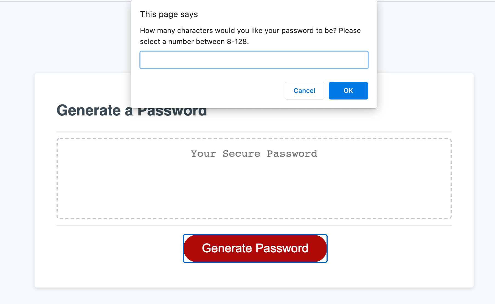
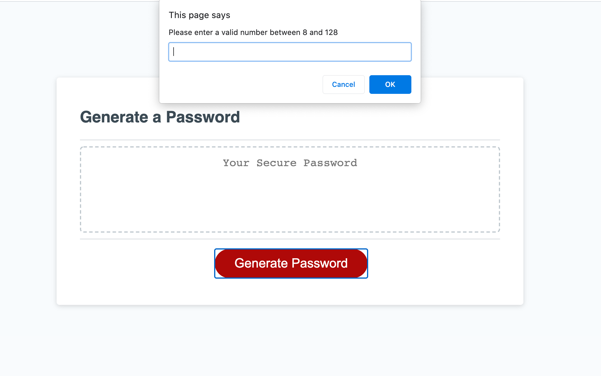
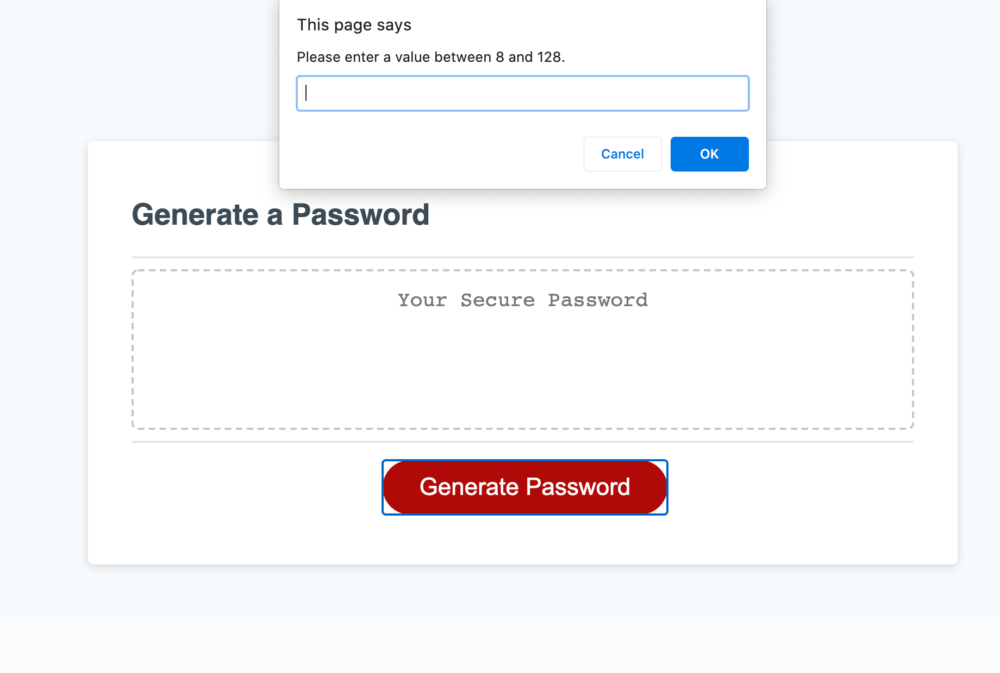
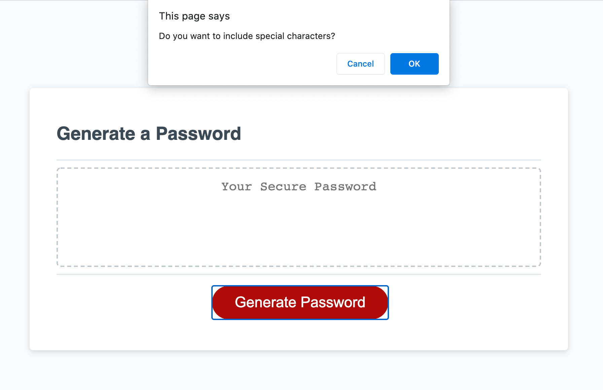
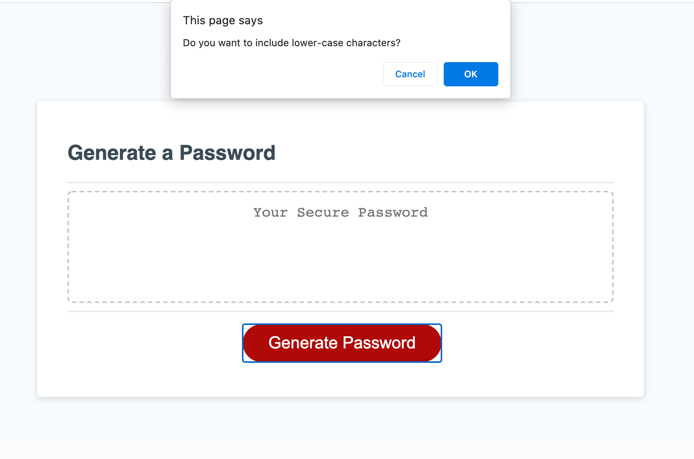
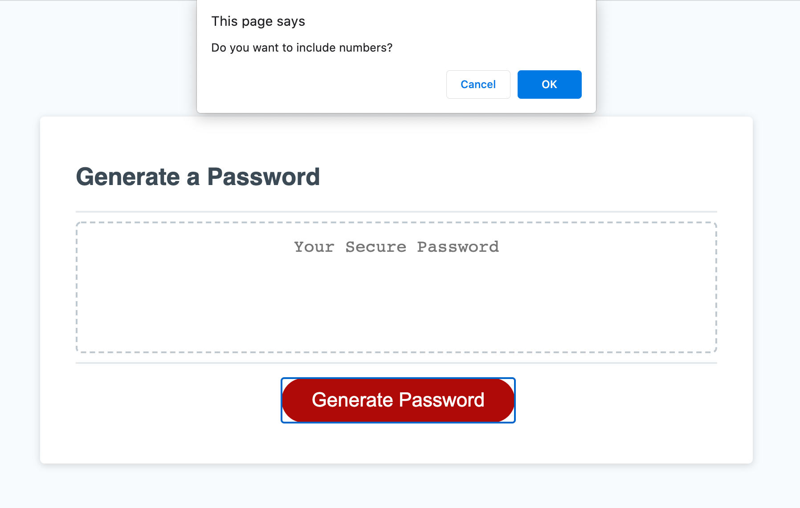
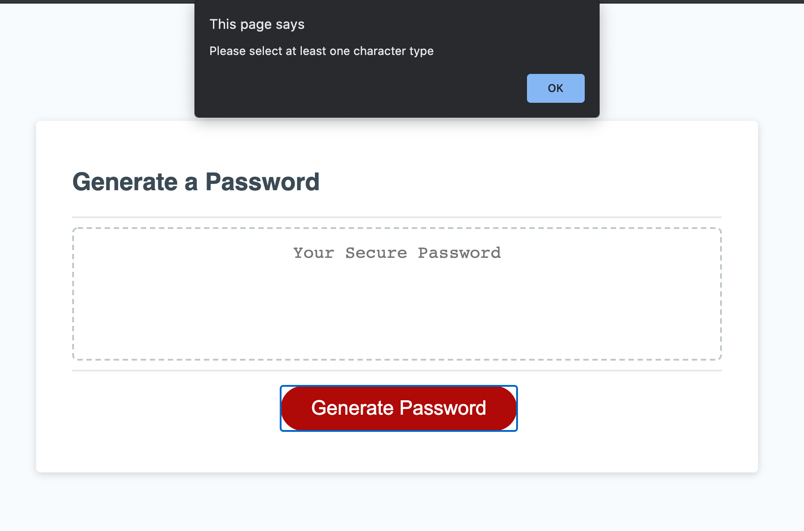
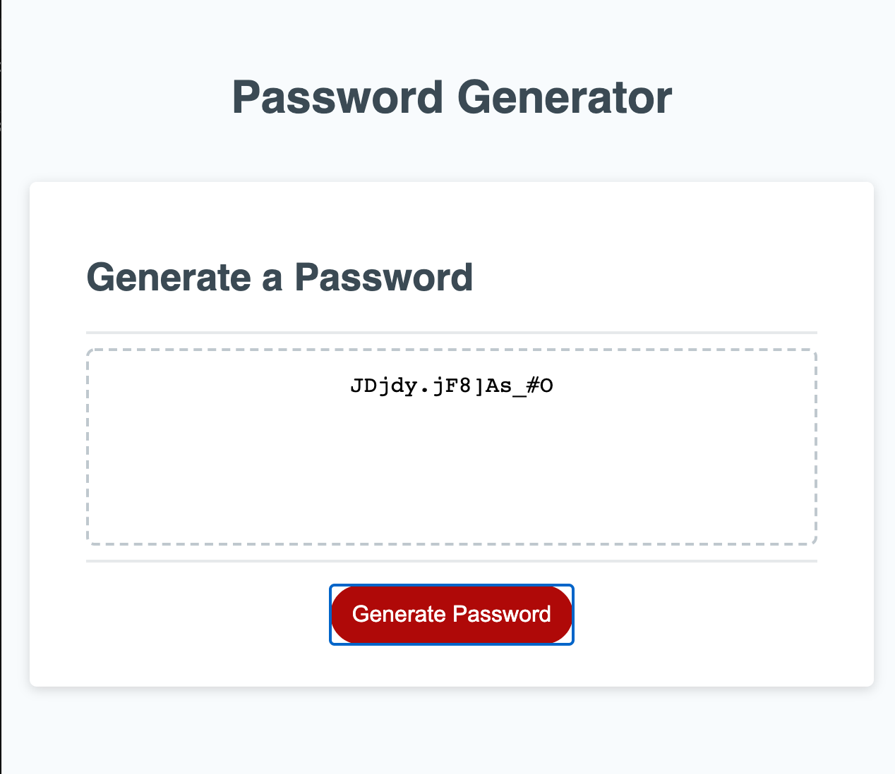

# Password Generator

The purpose of this webpage is to create a randomly generated password based on the user's requirements. When the user clicks the "generate password" button, he/she must first input their desired length: a value between 8 and 128. The screenshot below shows where the user will input this information. 

## Length Criteria

### Non-Numeric Character

If the user selects an invalid, non-numeric character, the screen will display the message below and the user will have the opportunity to enter a valid value: 

### Numeric value not within 8-128

If the user enters a value less than 8 or greater than 128, the screen will display the message below and the user will have the opportunity to re-enter a valid value: 

## Character Selection: Special, Upper Case, Lower Case, Numeric

Once the user has selected a valid character length, he/she will then be prompted with the option to include:

### Special Characters

### Upper Case Characters

### Lower Case Characters 

### Numeric Characters 

If the user does not select any character choice (special, upper, lower, numeric) then he/she will be prompted with a message that instructs the user to select at least one character type: 

When a user has selected a valid password length with at least one character type, the password will be generated and displayed for the user as seen below: 

## GitHub IO: 
https://thompsonel11.github.io/Password_Generator/

## GitHub Repository: 
https://github.com/thompsonel11/Password_Generator

